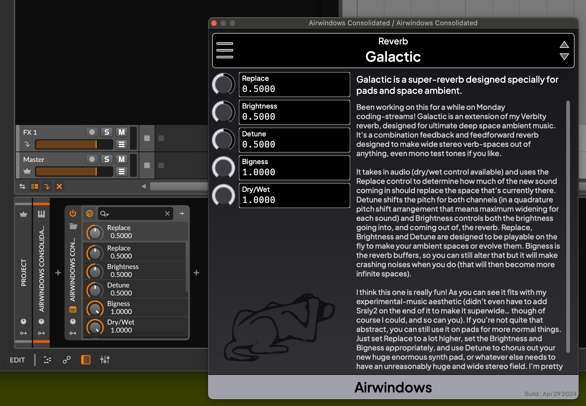

# All the Airwindows Consolidated


It's all the [airwindows](https://www.airwindows.com) presented in three lovely flavors




1. As a static library with a uniform registry and access pattern for you to use
   as a submodule to expose the airwindows
2. As module for [VCV Rack](https://www.vcvrack.com/) in the [Rack library](https://library.vcvrack.com/Airwin2Rack/Airwin2Rack) or as a [Rack nightly build](https://github.com/baconpaul/airwin2rack/releases/tag/Nightly). 
[Read the manual here.](doc/manual.md)
3. As a [CLAP/VST3/AU/LV2/Standalone](https://github.com/baconpaul/airwin2rack/releases/tag/DAWPlugin) plugin for your DAW. [Read the manual here.](doc/manualdaw.md)

Have fun! If you are a user the above links are everything you need. If you are a dev read on!

## The Library Version

The target `airwin-registry` builds a static library for you containing
all of the airwindows under a uniform api. Documenting this is still a
todo, but if you link this target, it will automatically populate the
datastructures so`AirwinRegistry.h` does what you would expect, which is 
give you a map to create `airwin2rackbase` operator objects. 

Have a question? Open an issue!

## The Rack Plugin

We are using @qno's excellent cmake SDK. This means the makefile works
like any other rack project.

But if you pull and want to clean build, make sure to run both the `clean` and `cleandep`
targets to rebuild fully.

## The JUCE plugin

Assuming you have git and a compiler and cmake working, the build
is easy.
If you are on unix install [these packages or their equivalent](https://github.com/baconpaul/airwin2rack/blob/736d9faf975c454cbb0c82746fd5266a4fd8723c/.github/workflows/build-daw-plugin.yml#L52).
Then clone the repo and execute the following.

Our nightly builds build 64 bit ubuntu x64, mac universal, and win x64,
but should build anywhere. We know it builds on linux ARM for instance.
If you are doing a build on an odd system and find a gotcha send us
a PR.

```bask
cmake -Bignore/daw-plugin -DBUILD_JUCE_PLUGIN=TRUE -DCMAKE_BUILD_TYPE=Release
cmake --build ignore/daw-plugin --target awcons-products
```

## Updating the airwindows sub-library

To update the airwindows library

1. Pull to the latest airwindows plugins

```bash
./scripts/updateToLatest.sh
```
3. Do a test build
```bash
RACK_DIR=(path-to-sdk) make -j cleandep
RACK_DIR=(path-to-sdk) make -j clean
RACK_DIR=(path-to-sdk) make -j install
```
4. Commit src libs and the infile and push to github

## A note on licensing

Airwindows is MIT licensed and the source code here is also.  For
avoidance of doubt, all code and content in `src`, in `libs/airwindows` and in
`res/awdoc` is freely available, under the MIT license, and fine to use
in closed source code. This means you can just link the `airwin-registry` 
cmake target, use `AirwinRegistry.h` and do what you want.

But a combined work with JUCE and the VST3 SDK (for the DAW plugin)
and with the VCV Rack SDK (for the Rack plugin) brings in GPL3
and GPL3+ dependencies. So even though the code in `src-juce`
and `src-rack` is MIT licensed code, building a distributable
product with those source files may result in your including
GPL3 assets.

Still unsure what you can use in a closed source environment?  The answer
is basicaly `AirwinRegistry.h` and its dependencies, the cmake target
`airwin-registry`, the documentation in `res/awdoc`, the top level
`CMakeLists.txt` and 
everyting in `src`. 

Still unclear? Open an issue with your particular situation 
and explain it.

The clipper airwindows graphic is freely distributed by airwindows

the jakarta and fira mono font are both openSIL
https://tokotype.github.io/plusjakarta-sans/
