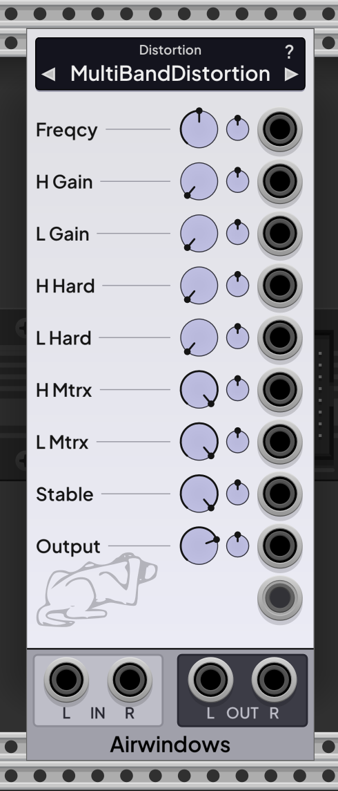
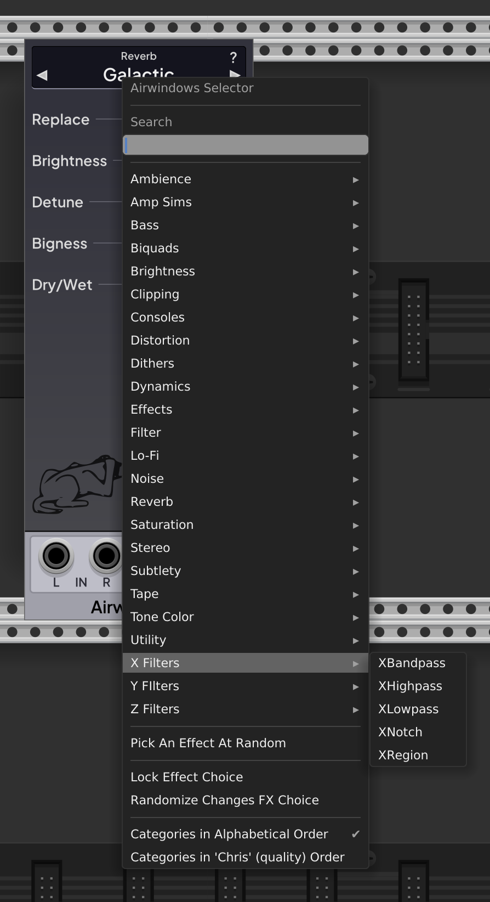
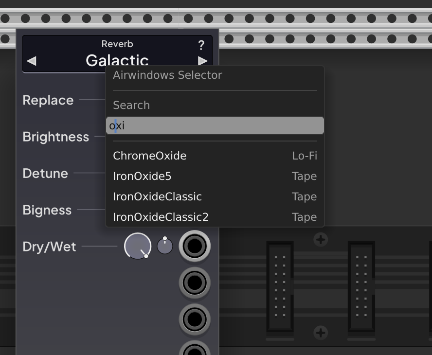
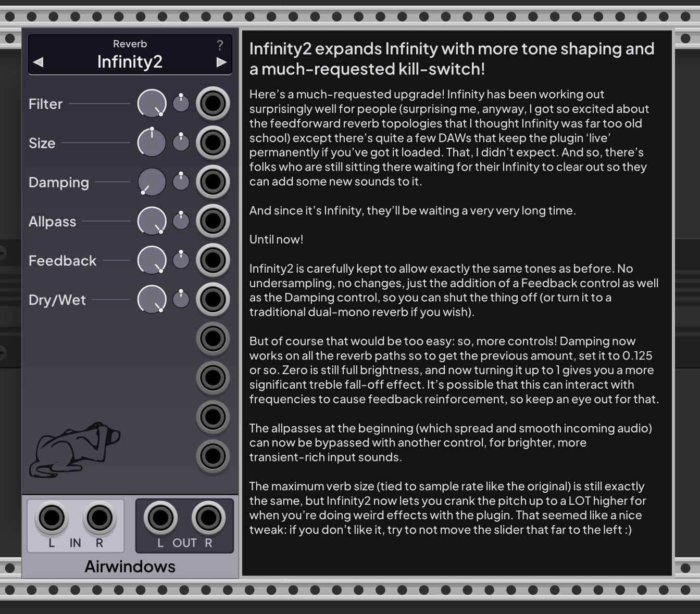
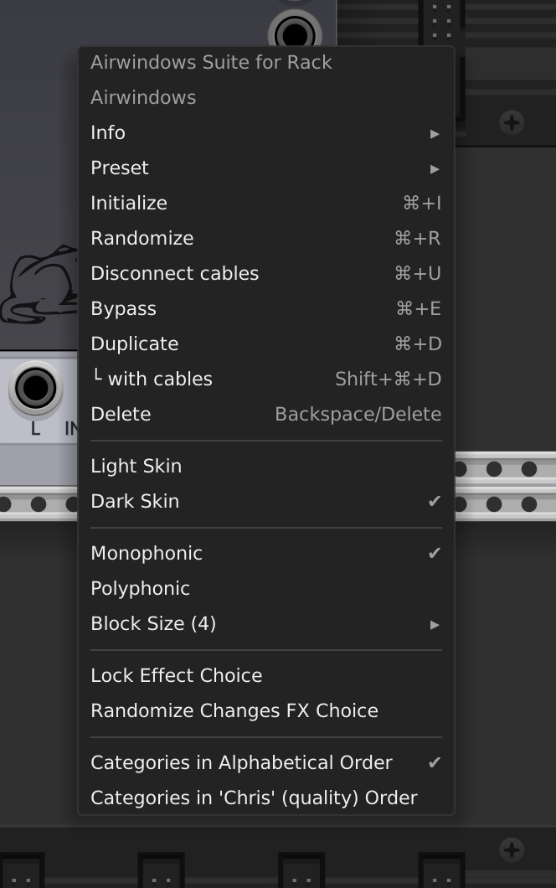

# Airwindows Suite for Rack

The Airwindows Suite for Rack imports the [airwindows](https://www.airwindows.com)
collection into VCV Rack as a single module using an automated workflow. The single
module contains all 300+ Airwindows effects, and is written to allow frequent updates
as new effects get added to the collection. The module was written in collaboration
between Chris from airwindows and BaconPaul from the surge team, with input from
several other surge team members and also from the rack community.

This manual documents the Rack module, but does not document each individual effect.
The effects are documented in the [Airwindopedia](https://www.airwindows.com/wp-content/uploads/Airwindopedia.txt)
but that documentation is also included in the plugin as a help tab in the module.

## Using the Module

The module has three core sections. The FX selector display at the top,
the FX parameter and modulation inputs in the center, and the stereo in
and out jacks at the bottom. By default the module will choose the 
super-awesome space-reverb, "Galactic". Simply plug your inputs in,
your outputs out, and listen to your sound drift away. 

You can edit an effect parameter setting using the knobs, or you can modulate
a parameter with the adjacent CV input scaled by the small knob bipolar attenuverter.
Almost every parameter supports typein values, but those that dont have the
typein supressed on the standard Rack widget menu.

No airwindow FX has more than 10 parameters, and the faceplate dynamically
changes to show between 0 and 10 knobs. To avoid 'dangling' cables, the 
CV inputs stay displayed, but with a dimmed port, to indcate they are inactive.

You can change the effect one of two ways.

First, you can press the arrow buttons beside the effect name to walk through
the effects in category and alphabetical order.

Second, you can click on the name of the effect or the category to open
a parameter selector menu. This menu allows you to select effects by category:

The menu also has a search-by-name feature which allows you to type in a partial
name of an effect and search across the suite.

## Getting Help

Airwindows is a collection of 300+ effects, and each one is a unique piece
of DSP code. Chris has documented each of them in a post when he releases them,
and we programatically import those posts from the Airwindowpedia and make them
available as a slide-out help overlay. Just press the "?" on the top of a panel
to overlay the help text, and press it again to close it.

## Deeper Topics

There are several other features of the module which may help you use it
in your patches, all of which are on the main menu

### Polyphony

By default, Airwindows runs a single instance of the effect and sums
the input voltages to a monophonic signal. In many cases this is what you
want, but in some, especially filters and accent effects, you may want to 
polyphonically apply and modulate the effect. If you choose "Polyphonic" in 
the menu, the module will create an instance of the effect per channel,
and will use the CV inputs polyphonically if they have polyphonic modulators
applied. This setting can increase CPU usage substantially for some effects,
so use it with caution.

### Block Size

The Airwindows core DSP code is targeted for DAW plugin environments and
as such processes on a block sample basis. The effects work with very small blocks,
but also do some pre-block setup, so smaller blocks can more CPU taxing for
some of the effects.

To allow you to select a tradeoff between higher latency (since a longer block
size requires more pre-cached information before processing) and higher CPU
(since a smaller block size will undertake a setup stage more frequently),
you can select a power-of-2 block size between 4 and 64 in the main menu.
The default is 4 samples.

### Lock Type, Lock Randomization

By default, user actions can change the effect at any time, but rack randomization
will only change parameters. Both of these are adjustable on a per-module basis.

### Dark and Light Mode

I mean this is pretty obvious right? But we support both! This is a sticky collection
wide setting.

### "Chris" order vs "Alpha" Order

By default the category menus are in alphabetical order. But Chris maintains
the categorization in the Airwindopedia, where he lists the effects in a
subjective "Quality" order. If you would rather present your menus in 
this order, select "Chris" order. This is a sticky collection wide setting.
