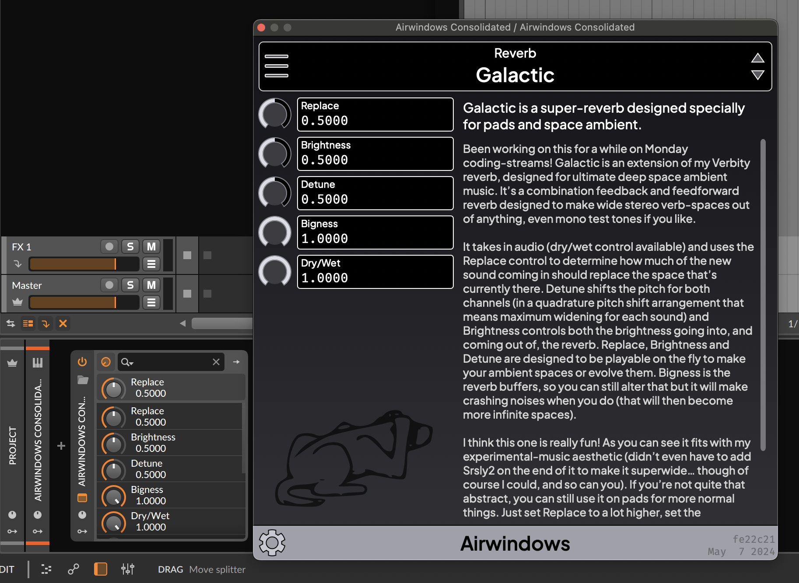

# Airwindows Consolidated Plugin

The Airwindows Consolidated Plugin is a [CLAP](https://cleveraudio.org)/AU/VST3/LV2/Standalone which uses
[JUCE](https://juce.com) to expose all the Airwindows as a single plugin,
complete with documentation. It is a standard stereo plugin which works 
in your DAW like any other effect.

The Airwindows Consolidated Plugin is open source software. You can [access the complete source code 
and read about licensing here](https://github.com/baconpaul/airwin2rack) or just 
[download a binary and enjoy the plugin.](https://github.com/baconpaul/airwin2rack/releases/tag/DAWPlugin)

## Installing the plugin

[Releases of the plugin are available on this github](https://github.com/baconpaul/airwin2rack/releases/tag/DAWPlugin) and
are updated every time Chris releases a new effect. 

To install
- on Windows download the `...-Setup.exe` file which is an installer and run it; or alternately download the
windows .zip file and place the plugins in the appropriate location. If you aren't sure which to choose,
choose the `...-Setup.exe` file.
- on macOS we provide a signed dmg containing a standard installer.
- on Linux, we provide a zip file of the plugins for you to move.

As open source software, on all three operating systems, if you prefer, you can always build yourself
using the [instructions on our README.](https://github.com/baconpaul/airwin2rack?tab=readme-ov-file#the-juce-plugin)
The binaries above use exactly that mechanism, run in github actions.

## Navigating the UI

The User Interface has three core regions. An effect selector, at top,
the parameters for that effect, in the left side column, and a documentation
section on the right. 

The selector has a menu, opened by clicking the 'hamburger' icon on the left
side and jog buttons which scroll through the effects on the right side. 

You can also click on the name of a plugin to activate a typeahead-search which
allows you to type a partial plugin or category name and see a set of matching
effects with their documentation to select.

The parameters display the current value and parameter name with a knob to
edit the value. Shift allows slower knob drags. Double clicking a knob returns
to default value. If you click on the value, 
a text editor appears allowing you to type in a value, or delete the value to 
return to default. For a very small
number of parameters, text entry isn't supported; in these cases no editor
will appear on click.

The documentation section displays the description of the effect which Chris
wrote on launch day in a scrollable area.

Finally the footer of the plugin shows the build date. Since this plugin updates
with every new effect, check back often for new builds!

## Effect Collections

The Airwindows collection has more than 350 effects, which can be daunting.
As a result we've grouped them into "Collections" which limit the presented
effect. The default collection ("Recommended") contains Chris's greatest hits.

To select a collection other than "Recommended", choose the "Filter by Collections"
menu and select a collection you want. "All plugins" choice removes any filtering.

## Using a Screen Reader

The User Interface is exposed via a Screen Reader on macOS and Windows.
Tab moves between elements, as expected. On the controls the arrow keys
change values, with shift depressed change values in a smaller increment.
Home and End will set a value to extrema, and delete will set it to default.
On a given knob, Shift-F10 will activate the typein area allowing you to
key in a value. As noted above, a small number of parameters do not support
text-to-value; for those Shift-F10 will do nothing.

The documentation region by default is a read-only label, but many screen
readers present large labels poorly. For Screen Reader users we recommend
you convert that label to an editable region by pressing F7 or choosing
the setting menu item. This only need be done once and is sticky on a machine.

## Bugs, Changes, Feedback

The Airwindows Consolidated plugin is open source software. Have an idea? Open
an issue in this repo or chat with us in the airwindows channel on surge discord.
Have a change? Open a pull request (but if its a big one, perhaps open an issue first
to chat). And finally, if you want to support Chris's continued investments in Airwindows,
he has a patreon which is linked from [airwindows.com](https://airwindows.com/).
